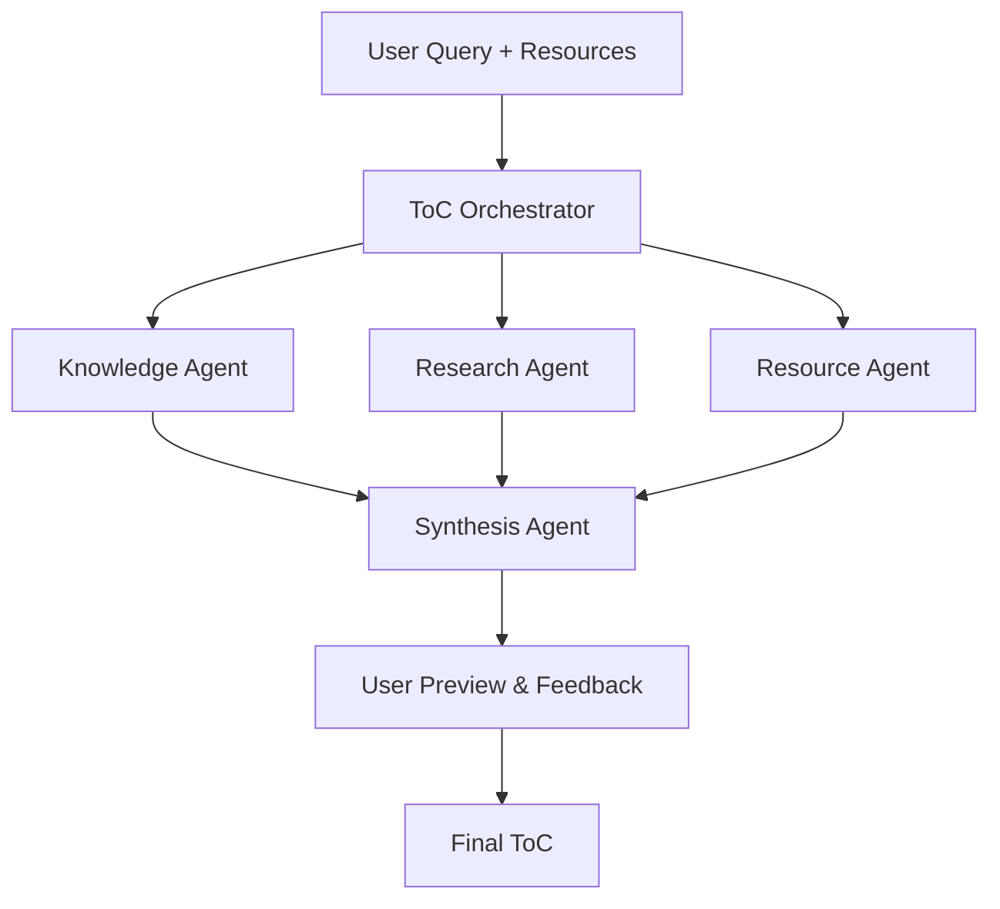

# Multi-Agent ToC Generation Architecture
## Engineering Design Document v1.0

### 🎯 **Problem Statement**
Current single-agent ToC generation works but lacks:
- Integration with user-provided resources
- Access to existing company knowledge base
- Web research for current trends/information
- Structured evaluation and improvement

### 🏗️ **Proposed Architecture: Orchestrator + 3 Specialized Workers**



### 📋 **Agent Specifications**

#### **1. ToC Orchestrator (Lead Agent)**
**Role**: Plan decomposition and coordination
**Responsibilities**:
- Analyze user query and learning goals
- Create research plan with 3 parallel tasks
- Coordinate subagents (no direct ToC generation)
- Final synthesis of results

**Tools**: None (coordination only)
**Context Limit**: 50K tokens (planning only)

#### **2. Knowledge Agent (Subagent)**  
**Role**: Company knowledge base expert
**Responsibilities**:
- Search existing ToCs on similar topics
- Extract relevant learning patterns
- Identify knowledge gaps

**Tools**: 
- Database search tool
- Vector similarity search
- Knowledge graph queries

**Output Format**: Structured knowledge summary

#### **3. Research Agent (Subagent)**
**Role**: Current trends and web intelligence  
**Responsibilities**:
- Research latest developments in learning topic
- Find current best practices and trends
- Identify new learning methods/tools

**Tools**:
- Web search tool
- Academic paper search
- Industry report access

**Output Format**: Research findings summary

#### **4. Resource Agent (Subagent)**
**Role**: User resource analysis
**Responsibilities**:
- Analyze user-provided documents/links
- Extract learning preferences and goals
- Identify existing knowledge level

**Tools**:
- Document analysis tool
- PDF/text extraction
- Content summarization

**Output Format**: Resource analysis summary

#### **5. Synthesis Agent (Final Processing)**
**Role**: ToC generation and quality assurance
**Responsibilities**:
- Combine all subagent inputs
- Generate personalized ToC
- Apply quality checks and validation

**Tools**: None (LLM-only synthesis)
**Output Format**: Validated PersonalizedBookStructure

### 🔄 **Execution Flow**

#### **Phase 1: Planning (Orchestrator)**
```python
def plan_research(user_query, user_resources, user_profile):
    """
    Create parallel research plan for subagents.
    """
    return {
        "knowledge_search_query": "Find existing ToCs for {topic}",
        "research_focus": "Latest trends and best practices in {topic}",
        "resource_analysis_scope": "Extract learning goals and preferences",
        "synthesis_requirements": "Combine findings into personalized ToC"
    }
```

#### **Phase 2: Parallel Execution (3 Subagents)**
```python
# All run simultaneously (parallel execution)
knowledge_results = knowledge_agent.search_company_db(plan.knowledge_query)
research_results = research_agent.web_research(plan.research_focus)  
resource_results = resource_agent.analyze_docs(user_resources)
```

#### **Phase 3: Synthesis (Synthesis Agent)**
```python
def synthesize_toc(knowledge_results, research_results, resource_results, user_profile):
    """
    Generate final ToC combining all inputs.
    """
    return PersonalizedBookStructure(
        title=generate_title(user_profile, topic),
        chapters=merge_and_personalize(
            existing_patterns=knowledge_results,
            current_trends=research_results,
            user_preferences=resource_results,
            user_profile=user_profile
        )
    )
```

### 🛠️ **Technical Implementation**

#### **State Management**
```python
class ToCAgenStage:
    orchestrator_plan: Dict[str, str]      # Research plan
    knowledge_findings: Dict[str, Any]     # DB search results  
    research_findings: Dict[str, Any]      # Web research results
    resource_analysis: Dict[str, Any]      # User resource analysis
    synthesis_input: Dict[str, Any]        # Combined inputs
    final_toc: PersonalizedBookStructure   # Final output
```

#### **Context Window Management**
- **Orchestrator**: 50K tokens (planning only)
- **Each Subagent**: 100K tokens (independent context)
- **Synthesis Agent**: 150K tokens (combining results)
- **Total System**: ~400K tokens (vs 200K+ for sequential approach)

#### **Tool Interfaces**
```python
# Knowledge Agent Tools
@tool
def search_company_knowledge_base(query: str, topic: str) -> List[Dict]:
    """Search existing ToCs and learning materials."""
    pass

# Research Agent Tools  
@tool
def web_search_current_trends(topic: str, focus_areas: List[str]) -> Dict:
    """Research latest developments and best practices."""
    pass

# Resource Agent Tools
@tool
def analyze_user_documents(files: List[str]) -> Dict:
    """Extract learning goals and preferences from user resources."""
    pass
```

### 📊 **Evaluation Strategy**

#### **Automated Evaluation**
```python
class ToCEvaluator:
    def evaluate_completeness(self, toc: PersonalizedBookStructure) -> float:
        """Check if ToC covers all essential topics."""
        
    def evaluate_personalization(self, toc: PersonalizedBookStructure, user_profile: Dict) -> float:
        """Check if ToC is properly personalized."""
        
    def evaluate_progression(self, toc: PersonalizedBookStructure) -> float:
        """Check if chapters have logical learning progression."""
```

#### **Human Evaluation Points**
- User feedback on preview (immediate)
- Learning outcome tracking (long-term)
- Expert review for quality domains

### ⚡ **Performance Optimizations**

#### **1. Caching Strategy**
```python
# Cache expensive operations
knowledge_cache = Redis("knowledge_searches") 
research_cache = Redis("web_research_results")
resource_cache = Redis("document_analysis")
```

#### **2. Parallel Execution**
```python
# Run subagents simultaneously
async def execute_research_phase(plan):
    knowledge_task = knowledge_agent.execute(plan.knowledge_query)
    research_task = research_agent.execute(plan.research_focus)
    resource_task = resource_agent.execute(plan.resource_scope)
    
    return await asyncio.gather(knowledge_task, research_task, resource_task)
```

#### **3. Context Optimization**
```python
# Compress subagent outputs for synthesis
def compress_findings(raw_findings: Dict) -> Dict:
    """Compress detailed findings to key insights only."""
    return {
        "key_insights": extract_top_insights(raw_findings),
        "supporting_evidence": summarize_evidence(raw_findings),
        "confidence_scores": calculate_confidence(raw_findings)
    }
```

### 🚀 **Implementation Phases**

#### **Phase 1: Foundation (Week 1-2)**
- Implement orchestrator with simple planning
- Build basic knowledge agent (DB search)
- Create synthesis agent with simple merging

#### **Phase 2: Intelligence (Week 3-4)**  
- Add research agent with web search
- Add resource agent with document analysis
- Implement parallel execution

#### **Phase 3: Quality (Week 5-6)**
- Add evaluation framework
- Implement caching and optimization
- User testing and feedback integration

### 🎯 **Success Metrics**

#### **Quality Metrics**
- ToC completeness score (automated)
- Personalization relevance (user feedback)
- Learning progression logic (expert review)

#### **Performance Metrics**
- Total execution time < 2 minutes
- Token usage < 500K per request
- Success rate > 95%

#### **Business Metrics**
- User satisfaction with ToC quality
- Reduction in ToC revision requests
- Increase in book completion rates

### 🔒 **Risk Mitigation**

#### **Technical Risks**
- **Agent coordination failures**: Implement retry logic and fallbacks
- **Context window overflow**: Compress outputs between phases
- **Tool failures**: Graceful degradation to single-agent mode

#### **Quality Risks**
- **Inconsistent ToC quality**: Automated quality checks + human review
- **Poor personalization**: Enhanced user profiling and feedback loops
- **Outdated information**: Regular cache invalidation and source verification

### 💰 **Cost Analysis**

#### **Token Usage Comparison**
- **Current Single Agent**: ~50K tokens
- **Proposed Multi-Agent**: ~400K tokens  
- **Cost Increase**: 8x tokens for significantly higher quality

#### **Value Justification**
- Better personalization → Higher user satisfaction
- Current information → More relevant learning
- Quality assurance → Reduced revision cycles
- User resource integration → Better adoption

### 🏁 **Conclusion**

This architecture provides a **practical balance** between:
- ✅ **Complexity**: Manageable 5-agent system vs your 7+ agent proposal
- ✅ **Value**: Clear improvement over current single-agent approach  
- ✅ **Performance**: Parallel execution with reasonable token usage
- ✅ **Reliability**: Proper error handling and fallback mechanisms
- ✅ **Scalability**: Can add more specialized agents as needed

**Next Steps**: Review this proposal, provide feedback, and we can begin implementation planning. 