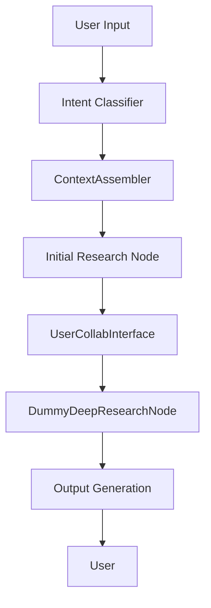

# Learning Topic Workflow: Architecture & Best Practices

## 1. Overview
This document describes the architecture, data flow, and best practices for the "Learn a Topic" use case in the Learning Agent. It is designed for production-readiness and as a blueprint for implementation and onboarding.

---

## 2. High-Level Workflow

```mermaid
graph TD
    A[Intent Classification] --> B[Context Assembly]
    B --> C[Initial Research Node]
    C --> D[Draft Table of Contents + Summaries]
    D --> E[User Approval/Collaboration]
    E --> F[Deep Research Node (LLM Placeholder)]
    F --> G[Output Generation & Book Writing]
```

---

## 2.1 Current Implementation (Post-Intent Classification)

After intent classification, the following nodes are implemented in sequence:

1. **ContextAssembler**: Assembles user profile, preferences, topic, existing book summaries, and user resources into a context object. Uses mock data for now.
2. **InitialResearchNode**: Generates a draft Table of Contents (ToC) and short summaries for the requested topic using a simple prompt. Returns dummy data for now.
3. **UserCollabInterface**: Presents the draft ToC and summaries to the user, collects a single round of feedback (simulated approval in the current implementation).
4. **DummyDeepResearchNode**: Placeholder for future deep research logic. Currently, it simply echoes the ToC and summaries as book content using the LLM only.
5. **Output Generation**: Assembles the final book in Markdown format and returns it to the user.

**Note:** There is no routing loop after user feedback; only a single round of feedback is allowed before proceeding to deep research. The deep research node is a placeholder and will be replaced with advanced research logic in the future.

---

## 3. Step-by-Step Flow

### 3.1 Intent Classification
- Detects if the user wants to learn a topic (e.g., "Learn AI evals").
- Output: `{ intent: LEARN_TOPIC, topic: "AI evals" }`

### 3.2 Context Assembly (ContextAssembler)
- **Inputs:** User profile, learning preferences, intent result, existing books, user-provided resources.
- **Process:**
  - Retrieve the summary of each existing book on the topic (we maintain a summary alongside each book for quick retrieval and analysis).
  - Extract the user’s learning style and preferences.
  - Gather any user-uploaded resources.
  - Summarize or chunk context to fit LLM window.
  - Rank context elements by relevance.
- **Output:** Optimized context object for research.

### 3.3 Initial Research Node
- **Inputs:** Assembled context, user’s topic.
- **Process:**
  - Use a simple prompt for now to ask the LLM: “Given this user and their context, what are the essential topics and subtopics for learning X?”
  - This node is designed for future comprehensive prompt engineering, and will have access to internet/search tools (and, in the future, curated expert content/books on the topic).
  - Output: Table of contents (ToC) with short summaries for each topic.

### 3.4 User Collaboration
- **Inputs:** Draft ToC and summaries.
- **Process:**
  - Present the draft ToC and summaries to the user.
  - Ask smart, clarifying questions to ensure user satisfaction.
  - The user can provide feedback or suggestions **once** (not a loop).
  - After this single round, the LLM proceeds to the next step.

### 3.5 Deep Research Node (Dummy)
- **For Now:**
  - Implemented as a dummy node using only the LLM (no MCP servers, no advanced search tools yet).
  - The architecture is designed for future expansion to use advanced research tools, agents, and internet search.
  - Simply echoes the ToC and summaries as book content.

### 3.6 Output Generation
- Assemble research results into structured book format (Markdown).
- Summarize, format, and attribute sources.
- Save/update book in user’s knowledge base.

---

## 4. Core Components & Responsibilities

| Component                | Responsibility                                                                 |
|--------------------------|-------------------------------------------------------------------------------|
| **ContextAssembler**     | Build, optimize, and manage context for each research step                    |
| **BookStateManager**     | Discover, summarize, and manage existing books/knowledge                      |
| **ResearchCoordinator**  | Orchestrate research phases, select agents, manage parallelism                |
| **UserCollabInterface**  | Present drafts, collect feedback, enable human-in-the-loop                    |
| **RoutingOrchestrator**  | Route workflow based on user input and approval                               |
| **SpecializedAgents**    | Perform deep research using RAG, web, code, or other tools                    |
| **ContextWindowManager** | Summarize, chunk, and optimize context for LLM window limits                  |

---

## 5. Best Practices: Context Engineering, RAG, Prompt Engineering

### 5.1 Context Engineering
- **Dynamic Context Assembly:** Build context on-the-fly for each query, using only the most relevant user data, prior knowledge, and resources.
- **Context Window Optimization:** Use summarization, chunking, and ranking to fit within LLM limits (e.g., 8k, 32k tokens).
- **Context Prioritization:** Rank context elements by relevance (e.g., recency, similarity, user preference).
- **Context Compression:** Use LLMs to summarize or compress large context blocks.
- **Hybrid Context:** Combine structured (profile, preferences) and unstructured (prior books, notes) data.

### 5.2 RAG (Retrieval-Augmented Generation)
- **Hybrid Retrieval:** Use both vector (semantic) and keyword (BM25) search for best recall.
- **Chunking:** Store knowledge in small, meaningful chunks (e.g., paragraphs, sections).
- **Metadata Filtering:** Filter retrievals by topic, recency, user, etc.
- **Re-ranking:** Use LLMs or cross-encoders to re-rank retrieved chunks for relevance.
- **Source Attribution:** Always track and return sources for transparency.

### 5.3 Prompt Engineering
- **Prompt Templates:** Use modular, parameterized templates for each agent/task.
- **Few-shot Examples:** Include examples in prompts to guide LLM behavior.
- **Dynamic Prompt Assembly:** Build prompts dynamically based on context and user state.
- **Instruction Clarity:** Use explicit, step-by-step instructions for LLMs.
- **Output Formatting:** Specify output schemas (e.g., JSON, Markdown) for easy parsing.

### 5.4 LangChain & LangGraph Best Practices
- **Composable Chains:** Build modular, reusable chains for context assembly, retrieval, and research.
- **Stateful Workflows:** Use LangGraph’s state management to persist and pass context.
- **Tool Integration:** Use LangChain’s tool and agent interfaces for specialized research.
- **Observability:** Use LangSmith or similar for tracing, debugging, and monitoring.

---

## 6. Data Flow Diagram



---

## 7. State Schema (for this phase)

```python
AgentState = {
    "messages": List[Message],
    "user_profile": UserProfile,
    "current_request": BookRequest,
    "generated_book": GeneratedBook,
    "current_intent": IntentClassification,
    "current_topic": str,
    "learning_context": Dict[str, Any],
    "session_id": str,
    "timestamp": str,
    # ...
}
```

---

## 8. Example Prompt Templates

### 8.1 Initial Research Node Prompt
```
You are an expert curriculum designer. Given the following user profile, learning preferences, and prior knowledge (including summaries of existing books), generate a table of contents (with short summaries) for a comprehensive book on the topic: {topic}.

User Profile: {user_profile}
Learning Preferences: {learning_preferences}
Existing Knowledge Summaries: {existing_knowledge}
User Resources: {resource_context}

Output format:
# Topic
## Topic Summary
...
```

### 8.2 User Collaboration Prompt
```
Here is a draft table of contents for your book on {topic}. Please review and suggest any changes, additions, or removals. You can also clarify your goals or provide more information.

Draft ToC:
{draft_toc}

What (if anything) would you like to change or clarify? (You can only provide feedback once before we proceed to deep research.)
```

---

## 9. User & System Interaction Flow

1. **User**: "I want to learn AI evals."
2. **System**: Classifies intent as LEARN_TOPIC, extracts topic "AI evals".
3. **System**: Assembles context (profile, preferences, prior knowledge summaries, resources).
4. **System**: Generates draft ToC and summaries for "AI evals" (using LLM, with internet/search access if available).
5. **User**: Reviews, edits, or approves ToC (single round of feedback).
6. **System**: If approved, routes to dummy deep research node (LLM only for now).
7. **System**: Aggregates research, generates book, attributes sources.
8. **User**: Receives completed book in Markdown format.

---

## 10. Observability, Testing, and Monitoring
- **Trace all context assembly and research steps (LangSmith, logging).**
- **Test context window limits and summarization strategies.**
- **Monitor agent/tool selection and retrieval quality.**
- **Collect user feedback at every major step.**

---

## 11. Next Steps
- Review and refine this plan with the team.
- Define interfaces and data contracts for each component.
- Begin implementation of ContextAssembler and Initial Research Node.
- Set up prompt templates and context window management utilities.

---

*This document is a living blueprint. Update as the system evolves and as new best practices emerge.* 