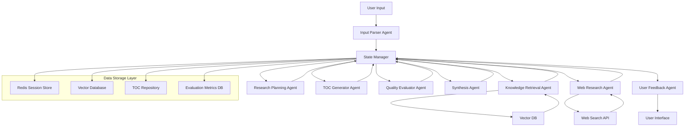
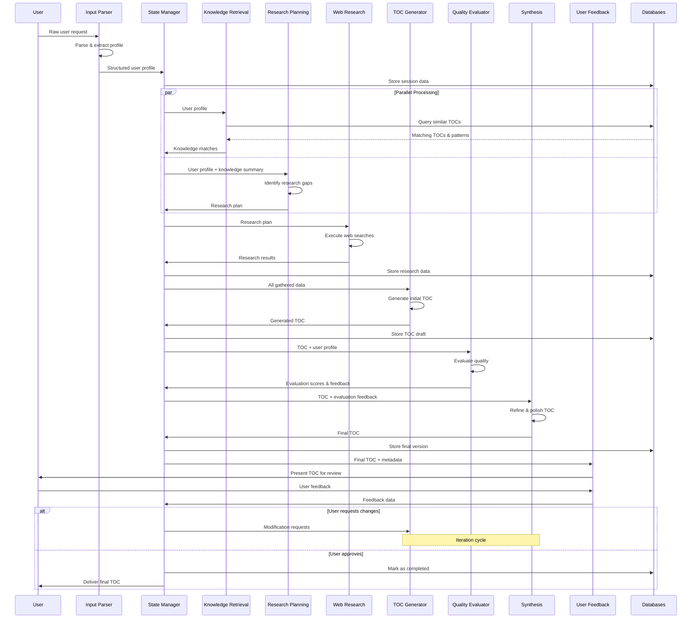
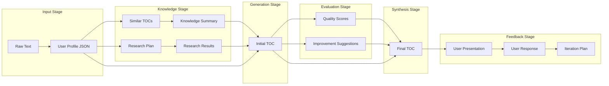
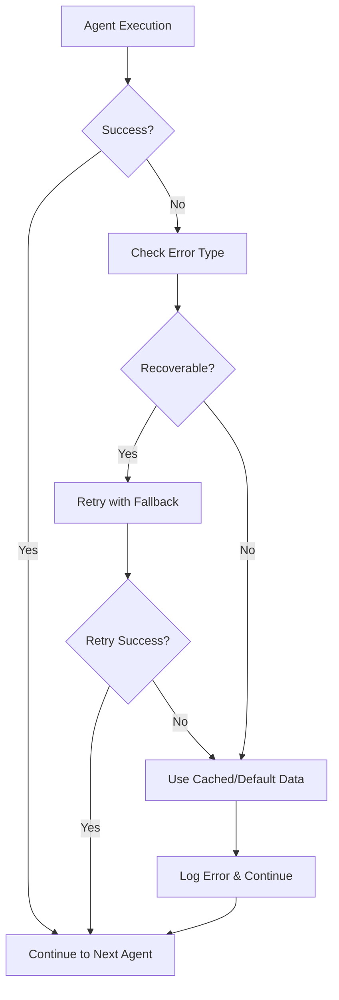

# Complete Data Flow Architecture

## High-Level System Flow



## Detailed Data Flow Sequence



## Data Structure Flow



## Detailed Data Flow Description

### Stage 1: Input Processing
**Data In**: Raw user text
**Process**: 
- Text normalization and cleaning
- Entity extraction (skills, timeline, goals)
- Confidence scoring for each extraction
- Missing information identification

**Data Out**:
```json
{
  "session_id": "uuid-12345",
  "user_profile": {
    "background": {"skill": "Marketing", "years": 5, "confidence": 0.9},
    "target_role": "AI Product Manager",
    "timeline": "6 months",
    "learning_style": ["hands-on", "case-studies"],
    "knowledge_gaps": ["AI/ML fundamentals", "evaluation frameworks"]
  },
  "metadata": {
    "timestamp": "2025-07-22T10:30:00Z",
    "extraction_confidence": 0.85,
    "requires_clarification": false
  }
}
```

**State Manager Actions**:
- Creates session in Redis with TTL (24 hours)
- Logs initial user interaction
- Triggers parallel processing for knowledge retrieval and research planning

### Stage 2: Parallel Knowledge Discovery

#### Path A: Knowledge Retrieval
**Data In**: User profile JSON
**Process**:
- Convert profile to vector embedding
- Search vector database for similar user journeys
- Calculate cosine similarity scores
- Retrieve associated success metrics

**Data Out**:
```json
{
  "knowledge_matches": [
    {
      "toc_id": "marketing-to-ai-pm-v3",
      "similarity_score": 0.87,
      "user_success_rate": 0.73,
      "completion_time_avg": "5.2 months",
      "key_chapters": ["Marketing DNA in AI", "Technical Foundations", "Case Studies"],
      "proven_patterns": ["leverage existing skills first", "gradual technical depth increase"]
    }
  ],
  "pattern_insights": {
    "optimal_chapter_count": 10,
    "success_factors": ["practical examples", "portfolio projects"],
    "common_failure_points": ["technical overwhelm at chapter 3"]
  }
}
```

#### Path B: Research Planning
**Data In**: User profile + knowledge summary
**Process**:
- Gap analysis between user needs and existing knowledge
- Current market trend identification
- Research question prioritization

**Data Out**:
```json
{
  "research_plan": {
    "critical_questions": [
      {
        "question": "Current AI PM hiring requirements 2025",
        "search_queries": ["AI product manager jobs 2025", "AI PM interview trends"],
        "priority": "high",
        "expected_impact": "Will inform job-readiness requirements"
      }
    ],
    "research_scope": "market trends, tool updates, success stories",
    "estimated_duration": "10-15 minutes"
  }
}
```

**State Manager Actions**:
- Waits for both parallel processes to complete
- Merges knowledge and research plan
- Checks context window usage (typically ~3K tokens at this point)

### Stage 3: Web Research Execution
**Data In**: Research plan
**Process**:
- Execute web searches using provided queries
- Source credibility validation
- Information extraction and relevance filtering
- Cross-reference findings across sources

**Data Out**:
```json
{
  "research_results": {
    "findings": [
      {
        "topic": "AI PM hiring trends",
        "insights": [
          "Technical depth requirements increased 40% since 2024",
          "Portfolio projects now mandatory for 80% of roles",
          "AI safety knowledge critical for senior roles"
        ],
        "sources": ["anthropic.com/careers", "openai.com/blog", "techcrunch.com"],
        "confidence": 0.8,
        "recency": "within 3 months"
      }
    ],
    "actionable_recommendations": [
      "Include hands-on AI evaluation project",
      "Add AI safety ethics chapter",
      "Emphasize portfolio development throughout"
    ]
  }
}
```

**State Manager Actions**:
- Validates research completeness
- Checks for any failed searches
- Summarizes if approaching context limits
- Prepares comprehensive data package for TOC generation

### Stage 4: TOC Generation
**Data In**: User profile + knowledge matches + research results + schema requirements
**Process**:
- Learning progression analysis
- Chapter structure optimization
- Personalization rationale development
- Schema compliance validation

**Data Out**: Complete TOC JSON (as shown in your example)

**State Manager Actions**:
- Stores generated TOC with version number
- Calculates token usage (typically ~6K tokens at this point)
- Prepares data for quality evaluation

### Stage 5: Quality Evaluation
**Data In**: Generated TOC + user profile + evaluation rubric
**Process**:
- Multi-dimensional scoring across quality metrics
- Benchmark comparison with successful TOCs
- Specific improvement identification
- Risk assessment for user's timeline

**Data Out**:
```json
{
  "evaluation_results": {
    "overall_score": 8.2,
    "dimension_scores": {
      "logical_progression": 9.0,
      "personalization_quality": 7.5,
      "market_relevance": 8.5,
      "timeline_feasibility": 8.0,
      "completeness": 8.0
    },
    "strengths": [
      "Strong marketing-AI connection in chapters 1-3",
      "Practical project integration",
      "Clear skill progression"
    ],
    "improvement_areas": [
      "Chapter 6 technical depth may be overwhelming",
      "Missing AI safety best practices",
      "Could use more evaluation framework details"
    ],
    "specific_recommendations": [
      {
        "chapter": 6,
        "change": "Split technical content across 2 chapters",
        "rationale": "Reduce cognitive load for marketing background"
      }
    ],
    "confidence": 0.85
  }
}
```

### Stage 6: Synthesis & Refinement
**Data In**: Original TOC + evaluation feedback + user profile
**Process**:
- Priority-based improvement implementation
- Consistency and flow optimization
- Final schema validation
- Quality assurance check

**Data Out**: Refined final TOC with improvements incorporated

**State Manager Actions**:
- Creates final version with change log
- Stores evaluation history
- Prepares user presentation package

### Stage 7: User Feedback Loop
**Data In**: Final TOC + evaluation scores + metadata
**Process**:
- Format for optimal user presentation
- Generate targeted feedback questions
- Create modification options
- Prepare iteration workflow

**Data Out**: User interface with TOC presentation and feedback collection

## Critical Data Flow Considerations

### Context Window Management
- **Token Tracking**: Each stage monitors cumulative token usage
- **Summarization Triggers**: Auto-summarize when approaching 8K tokens
- **Essential Data Preservation**: Flag critical information for retention during summarization
- **State Compression**: Use structured summaries rather than full text retention

### Error Handling & Fallbacks


### Data Persistence Strategy
- **Session Data**: Redis with 24-hour TTL
- **TOC Repository**: PostgreSQL for structured queries
- **Vector Embeddings**: Pinecone/Weaviate for similarity search
- **Evaluation Metrics**: Time-series database for performance tracking
- **User Feedback**: Separate table with user consent tracking

### Performance Optimization
- **Parallel Execution**: Knowledge retrieval and research planning run simultaneously
- **Caching Strategy**: Cache frequent user profile patterns and research results
- **Lazy Loading**: Only load full TOC details when needed for evaluation
- **Background Processing**: Research can continue while user reviews initial results

This architecture ensures reliable data flow, proper error handling, and scalable performance while maintaining clear separation of concerns across all agents.